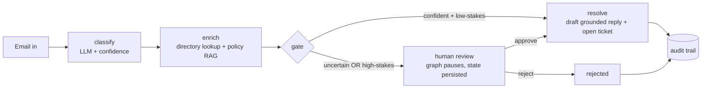

# IT Service Desk Agent

An AI agent that triages an IT helpdesk inbox end to end — and knows when *not* to act.

**[Live demo](https://it-servicedesk-agent-brvydxdbutibzchgwjup9y.streamlit.app/)** — click "Reset & run demo inbox", watch it classify 5 emails, then approve or reject the ones it escalated to you.

An email comes in. The agent reads it, classifies it, looks up the sender in the employee
directory, checks company policy, and then either resolves it — drafting a grounded reply
and opening a ticket — or pauses and waits for a human. Every decision lands in an
append-only audit trail with the model's reasoning and confidence attached.

I build enterprise RPA for a living (Automation Anywhere, Microsoft Graph, SAP). The
rule-based bots I ship break on any email they haven't seen before. This project is the
other half: an agent that *reasons* about novel cases, wrapped in the guardrails that
actually matter in production — human approval for anything high-stakes, durable state,
and a decision trail you can audit.

## Results

| Metric | Value |
|---|---|
| Classification accuracy (30-email labeled eval set) | **90%** (27/30) |
| Routing safety — uncertain or high-stakes items reaching a human | **100%** |
| Auto-resolution rate (demo inbox) | 60% |
| Eval set difficulty mix | 12 clear · 12 ambiguous · 6 edge cases |

The number I care most about is the second one. All three misclassifications on the eval
set were *low-confidence* misses — so the gate caught them and routed them to a human
anyway. The one confidently-wrong case (a contractor onboarding read as an access request
at 0.95) was still caught, because access requests are category-gated regardless of
confidence. Two independent guardrails; both have to fail for a bad auto-action.

## How it works



The flow is a LangGraph state machine. The LLM does the thinking — classification and
grounded drafting — but which systems get touched, and when a human must sign off, is
explicit, tested control flow, not left to model whim.

**Durable human-in-the-loop.** When an item escalates, the graph calls `interrupt()` and
its entire mid-flight state is checkpointed to SQLite. The process can exit; the machine
can reboot. Approval can come from the CLI or the dashboard — a different process,
minutes or days later — and the workflow resumes exactly where it stopped. Not re-run:
resumed.

**Grounded replies.** Drafts are composed from three sources: the email, the sender's
directory record, and the relevant policy snippet retrieved via embeddings. When Rita
reports a lockout, the reply reflects that her account *actually shows locked* and cites
the identity-verification step the policy requires.

**Fail-safe by default.** API error, unparseable model output, malformed email, unknown
sender — every failure mode degrades to "route to a human", never to a crash and never to
a silent wrong action. A classification failure returns zero confidence, and the gate does
the rest.

**Append-only audit.** Every event — classification (with reasoning), escalation, human
approve/reject, resolution — is an immutable row with a timestamp and an actor. "Why did
the agent do that?" is a query, not a shrug.

## Stack

Python 3.12 · LangGraph (+ SQLite checkpointer) · Anthropic Claude · sentence-transformers
(pluggable to Voyage via one env var) · SQLite · Streamlit

## Run it

```bash
git clone https://github.com/vigneshajayakumarv/it-servicedesk-agent.git
cd it-servicedesk-agent
python -m venv .venv && source .venv/bin/activate
pip install -r requirements.txt
cp .env.example .env          # add your Anthropic API key

python scripts/seed_directory.py      # mock employee directory
python scripts/inbox.py run           # process the inbox; high-stakes items pause
python scripts/inbox.py queue         # see what's waiting for you
python scripts/inbox.py approve EM-1004
python scripts/inbox.py reject EM-1003
python scripts/audit_report.py        # the full decision trail

streamlit run dashboard/app.py        # or do all of the above from the UI
python scripts/eval_dataset.py        # score the classifier on the labeled set
```

Close the terminal between `run` and `approve` if you want to see the point: the pause
survives the process.

## Layout

```
servicedesk/
  llm.py          classification + drafting (fail-safe fallbacks)
  hitl.py         the gate: confidence threshold + high-stakes categories
  audit.py        append-only decision log
  checkpoint.py   durable SQLite checkpointer
  agent/          LangGraph nodes + graph assembly
  tools/          directory lookup, policy RAG, actions (draft/ticket/escalate)
dashboard/        Streamlit operations UI (approve/reject resumes the graph)
data/             sample inbox, 30-email labeled eval set, policy docs
scripts/          inbox CLI, eval, audit report, seeds
```

## Design notes

- **Deterministic control flow, not LLM tool-calling.** The audit story is "the graph
  routed it because confidence was 0.62", not "the model decided to". For a system whose
  selling point is controlled autonomy, the control flow itself should be code.
- **Checkpointed state is plain JSON.** Rich objects in durable state are a versioning
  trap (and LangGraph is deprecating unregistered types). Pydantic validates at the
  boundaries; what persists is clean.
- **Eval set stays out of live traffic.** Accuracy is measured on held-out labeled data
  and displayed separately from operational metrics. Mixing them flatters both numbers.
- **The last mile is stubbed on purpose.** Replies land in an outbox, tickets in a local
  DB, password resets are simulated. Everything up to the irreversible step is
  production-shaped; the irreversible step is a clearly-marked seam where Graph/AD calls
  go.
